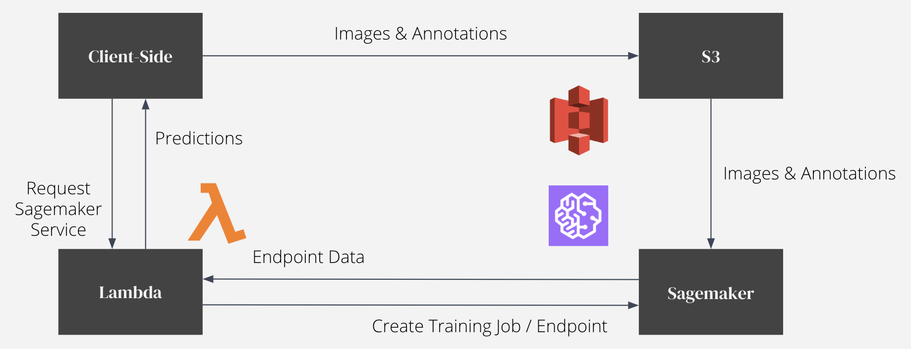

# Taker Assistant: Browser Labeling / Object Detection

This tool is for labeling objects in the browser and using the resulting annotations to train an object detection model.
The model trained through this tool is intended for use in the Urbanbase Taker API, found here: <br>
<br>
https://developer.urbanbase.com/products/space/
<br>
<br>
The ML model is trained through calls to AWS Lambda, which then creates a training job in Sagemaker using the built-in
object detection algorithm. The project architecture as it relates to AWS Services can be found below:
<br>
<br>

<br>
<br>
There is also an object labeling tool fully embedded into the browser, based off HTML canvas. Note that the number (and names)
of the classes can be changed by going into editing classes.js and create_training_job.js. The latter is actually the Lambda function
used to create a training job with a specified number of output classes.
<br>
<br>
Credits to Simon Sarris for his tutorial "A Gentle Introduction to Making HTML5 Canvas Interactive", from which I earned
the inspiration for my object labeling tool. The post can be found at: https://simonsarris.com/making-html5-canvas-useful/
<br>

## 로컬에 Taker Assistant 사용하는 방법

1. src 폴더에 aws-config.js이라는 이름의 파일을 생성합니다. 안에 다음과 같은 코드를 붙여넣습니다:<br>

```
const bucketRegion = //버켓 지역 (예: 'us-east-1');
const IdentityPoolId = //cognito identity pool 아이디;
AWS.config.region = bucketRegion;
AWS.config.credentials = new AWS.CognitoIdentityCredentials({ IdentityPoolId });

let s3 = new AWS.S3({
  apiVersion: '2006-03-01',
  params: { Bucket: //버켓 이름 (스트링) }
});

let lambda = new AWS.Lambda({
  apiVersion: '2015-03-31'
});
```

<br>
2. cognito identity pool을 만듭니다. https://console.aws.amazon.com/cognito/federated/ 로 가서 "새 자격 증명
풀 만들기"를 누른 후, "인증되지 않은 자격 증명에 대한 액세스 활성화"를 체크하고 풀을 생성합니다. 새롭게 생성된 자격 증명 풀의 아이디
(예: us-east-1:0afdcf18...)를 cognito에서 찾아 aws-config.js 있는 IdentityPoolId 변수에 할당합니다.
<br>
<br>
3. IAM Management Console에 가면 새로운 역할 두 개가 있을 텐데, "Unauth_Role" (인증되지 않은 역할)로 끝나는 역할에다가 
정책을 연결해서 S3, Lambda, 그리고 Sagemaker에 Full Access 접근 권한을 줍니다.
<br>
<br>
4. 똑같은 IAM 페이지에서 "Unauth_Role"로 끝나는 역할의 ARN을 페이지 윗단에서 복사합니다. 그후로 S3에 새로운 버켓을 생성하고
버켓 정체에 다음 정책을 편집해서 넣어줍니다: <br>
```
{
    "Version": "2012-10-17",
    "Id": "http referer policy example",
    "Statement": [
        {
            "Sid": "",
            "Effect": "Allow",
            "Principal": {
                "AWS": <Cognito Unauth_Role 역할 ARN을 여기다 붙여넣습니다.>
            },
            "Action": "s3:*",
            "Resource": "arn:aws:s3:::<버켓 이름>/*"
        }
    ]
}
```
<br>
5. S3버켓의 퍼블릭 액세스 차단을 비활성화 합니다. 그후로 새로 생성한 S3 버켓 이름을 aws-config.js의 s3 변수 안에 들어있는
"params: { Bucket: ... }"에 파라미터로 넘겨줍니다.
<br>
<br>
6. IAM Management Console에서 새로운 역할을 또 만듭니다. "이 역할을 사용할 서비스 선택"할 때 SageMaker를 고르고,
"사용 사례 선택"에서 Sagemaker - Execution이 선택되었는지 확인합니다. 그후로 알맞은 권한을 부여하고 역할을 만듭니다.
<br>
<br>
7. Lambda에 aws-lambda 폴더에 있는 함수들을 복사해서 넣어줍니다. 이름은 extension만 빼고 그대로 지켜줍니다. create_endpoint와
detect_objects는 Python 3.7, list_endpoints와 train_model은 Node.js 10.x로 함수들을 생성하면 됩니다. 기존 역할은 모두
Cognito에서 만든 Unauth_Role로 세팅해줍니다. (이 역할이 Lambda에 접근 권한이 있어야지만 기존 역할로 세팅할 수 있습니다.)
<br>
<br>
8. 마지막으로 create_endpoint, train_model, 그리고 detect_objects 코드에서 '변경'이라는 코멘트가 있는 부분을 변경해줍니다.
예를 들어 ExecutionRoleArn이라는 파라미터를 변경할 때, 6번 스텝에서 생성한 Sagemaker Execution 역할의 ARN을 넣어줍니다.
이와 비슷하게 <버켓 이름>이라고 쓰여있는 곳에는 생성한 S3버켓의 이름을 스트링으로 넣어줍니다.
<br>
<br>
9. 혹시나 us-east-1가 아닌 다른 지역에서 S3/Lambda/Cognito Role/Sagemaker를 운영하는 것이라면, Lambda 함수의 trainingImage
파라미터도 바꿔야 할 것입니다. Training Image 링크를 얻기 위해서 Sagemaker Notebook에 다음 코드를 실행하면 됩니다:
```
import sagemaker
from sagemaker.amazon.amazon_estimator import get_image_uri
sess = sagemaker.Session()
training_image = get_image_uri(sess.boto_region_name, 'object-detection', repo_version="latest")
print (training_image)
```
<br>
10. label.html을 열면 모든 것이 제대로 작동하길 바랍니다!
